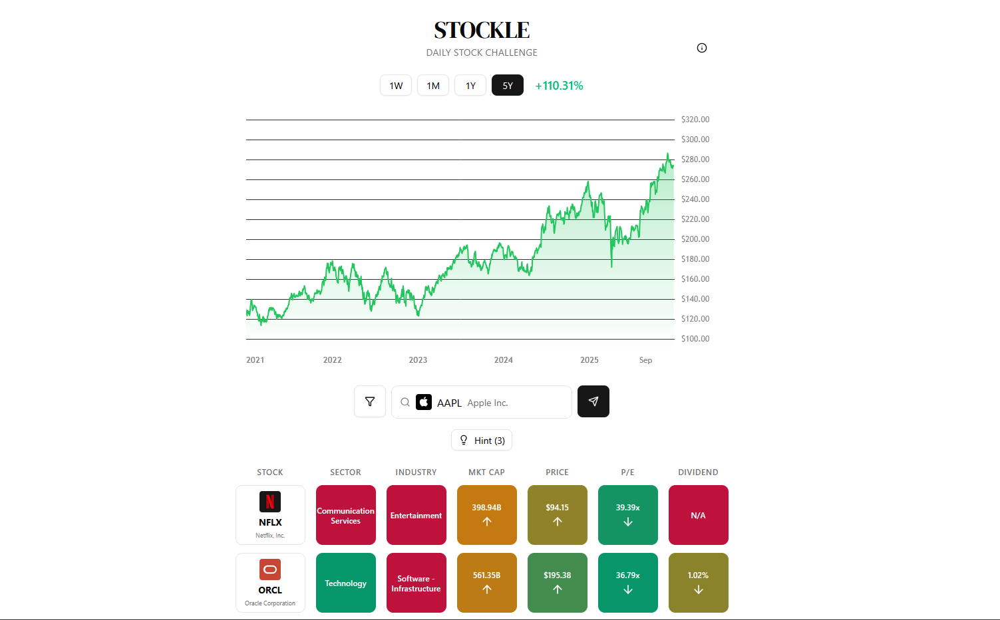

# Stockle 📈



Wordle but for stocks. I saw that there was none and wanted to play it so I made it. Players analyze a stock chart and information about a stock to try to guess what the stock is.

## Tech Stack

**Backend**: Spring Boot 3.2 + Java
**Database**: PostgreSQL
**Infrastructure**: Kubernetes, Docker, Nginx Ingress
**Data Pipeline**: Python, yfinance API, Kubernetes CronJob
**Frontend**: Next.js, React, TypeScript, Vercel


## How It Works

### Daily Puzzle Generation
A Python script runs daily to:
- Fetch real-time data for 250 top US stocks from Yahoo Finance
- Select a random stock from the top 50 by market cap (avoiding repeats from the last 30 days)
- Store 5 years of OHLCV price history in PostgreSQL as JSONB

### How to play 
1. Players see an anonymous price chart (5-year view, aggregated by month/week/day depending on zoom level)
2. They search from 250 stocks and submit guesses
3. Spring Boot API compares the guess against the target stock across 6 metrics:
   - Sector
   - Industry 
   - Market cap 
   - Current price 
   - P/E ratio 
   - Dividend yield

4. Color-coded feedback guides players:
   - 🟩 Green = correct match
   - 🟨 Yellow = close (gradient based on closeness score)
   - 🟥 Red = wrong/far off

5. Players get 6 guesses and 3 progressive hints (sector, industry, logo)

### Database Schema
```sql
stocks (ticker, company_name, sector, industry, market_cap, current_price, pe_ratio, dividend_yield)
daily_puzzles (puzzle_date, ticker, price_history[JSONB])
```